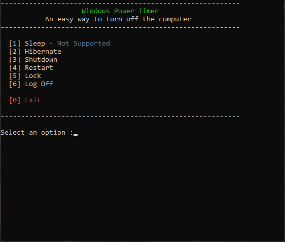
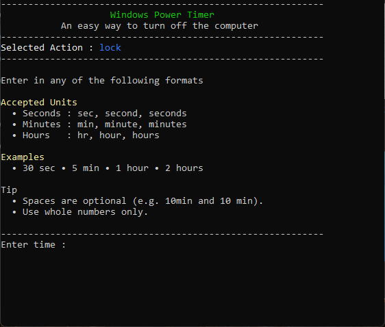
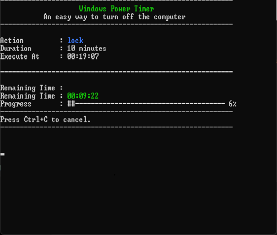

<div align="center">

# ⏱️ Windows Power Timer

_A lightweight Windows Batch utility to schedule power actions such as Shutdown, Restart, Sleep, Hibernate, Lock and Log Off after a specified duration._

<p align="center">


</p>

<br/>

<p align="center">


</p>

</div>

---

# Why I Built This

This project started as a utility for my own day-to-day use.

I often found myself needing to shut down my PC after large downloads, restart it once lengthy software installations had finished, lock my workstation before stepping away, or log off after remote sessions. Windows already provides commands for all of these tasks, but using them repeatedly wasn't particularly convenient.

There are plenty of applications that solve the same problem, but many of them include features I never needed, require installation, or stay running in the background. My goal was to build something that did one job well, remained easy to use, and stayed out of the way.

From the beginning, I wanted it to be:

- Lightweight
- Portable
- No installation required
- No external dependencies
- No background services
- Easy to modify and extend

The result is **Windows Power Timer**; a utility that's roughly **11 KB**, runs entirely using native Windows Batch, and relies only on tools already available in Windows.

As the project evolved, it also became an opportunity to explore what could be achieved with Batch scripting. Features such as modular functions, ANSI terminal styling, input validation, progress bars and a cleaner command-line interface were added while keeping the application simple and maintainable.

---

# About

Windows Power Timer is a lightweight command-line utility written entirely in native Windows Batch that lets you schedule common Windows power operations after a specified duration.

Instead of remembering different Windows commands or relying on third-party utilities, the application provides a simple interactive interface for scheduling actions such as:

- Shutdown
- Restart
- Sleep
- Hibernate
- Lock
- Log Off

The application accepts flexible, human-friendly time formats, validates user input, displays a live countdown with a progress bar and execution time preview, and performs the selected action once the timer expires.

Designed to be lightweight and portable, Windows Power Timer requires no installation, no external dependencies and no background services. Simply launch the batch file, choose an action, specify a duration and let the application handle the rest.

Although compact; at roughly **11 KB**, the project is organised into reusable modules for parsing, validation, formatting, countdown management and power operations, making it easy to understand, maintain and extend.

---

# Screenshots

| Main Menu                      | Instructions                      | Countdown                      |
| ------------------------------ | --------------------------------- | ------------------------------ |
|  |  |  |

---

# Features

- Interactive menu-driven interface
- Schedule Shutdown, Restart, Sleep, Hibernate, Lock and Log Off
- Flexible duration parser (`30s`, `15m`, `2h`, `1h 30m`, etc.)
- Live countdown with progress bar
- Execution time preview
- ANSI-coloured terminal interface
- Input validation and error handling
- Administrator privilege detection
- Modular Batch architecture
- No installation or external dependencies

---

# Supported Operations

| Operation | Description                            |
| --------- | -------------------------------------- |
| Shutdown  | Shut down the computer safely          |
| Restart   | Restart Windows                        |
| Sleep     | Put the computer into Sleep mode       |
| Hibernate | Save the current session and power off |
| Lock      | Lock the current Windows session       |
| Log Off   | Sign out the current user              |

---

# Time Formats

The parser accepts several common formats.

```text
30s        ●     45 sec     ●     15 seconds
10m        ●     30 min     ●     2 minutes
2h         ●     1 hr       ●     2 hours
1h 30m     ●     2hr 15min  ●     2h 15m 45s
```

---

# Running the Application

Clone the repository and open an elevated Command Prompt.

```bash
git clone https://github.com/SDhanush163/sleep-timer.git
cd sleep-timer
PowerTimer.bat
```

> Administrator privileges are required because some Windows power operations cannot be executed from a non-elevated console.

---

# Project Structure

```text
Windows-Power-Timer
│
├── actions/
│   ├── shutdown.bat
│   ├── restart.bat
│   ├── sleep.bat
│   ├── hibernate.bat
│   ├── lock.bat
│   └── logoff.bat
│
├── functions/
│   ├── countdown.bat
│   ├── formatter.bat
│   ├── instructions.bat
│   ├── parser.bat
│   ├── progressbar.bat
│   ├── ui.bat
│   ├── validator.bat
│   └── exception.bat
│
└── PowerTimer.bat
```

Each power action is isolated into its own script, while common functionality such as parsing, validation, formatting and countdown logic is implemented as reusable modules.

---

# Tech Stack

<p align="center">


</p>

Built using:

- Windows Batch
- Windows Command Prompt
- ANSI Escape Sequences
- Native Windows Power Commands

---

# Contributing

Suggestions, bug reports and pull requests are always welcome.

If you find an issue or have an idea that could improve the project, feel free to open an issue or submit a pull request.

---

# License

This project is licensed under the **Apache License 2.0**. See the [LICENSE](LICENSE) file for details or read the full license at https://www.apache.org/licenses/LICENSE-2.0.

---

<div align="center">

Built entirely with native Windows Batch.

</div>
